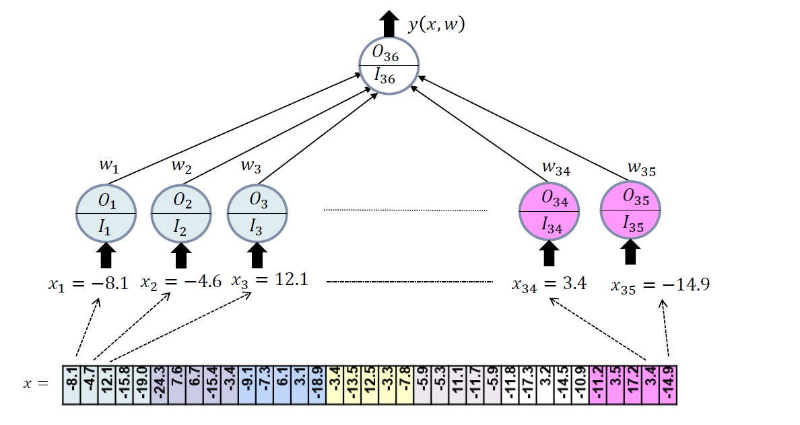

# Pattern recognition with Single Layer Neural Network

The objective of this project is to develop a Single Layer Neural Network (SLNN) to recognize sets of digits (0 to 9) from blurry images pseudo-randomly generated with Gaussian blur techniques. It is part of the course on unconstrained, non-linear optimization.

## About

**Course**  
Optimization Techniques for Data Mining (OTDM-MIRI)  
FIB - Universitat Politècnica de Catalunya. BarcelonaTech  
November 2021 

**Team**  
* Marcel Cases
&lt;marcel.cases@estudiantat.upc.edu&gt;
* Mengxue Wang
&lt;mengxue.wang@estudiantat.upc.edu&gt;

## Introduction

The goal of this laboratory assignment is to develop a Single Layer Neural Network (SLNN) that is able to classify digits from 0 to 9. The neural network takes as inputs vectorized values of the picture of the digit (7x5 px). Each neuron of the single layer will represent one of the 35 pixels, producing 35 weights associated to each neuron. These weights are connected to the 36th neuron, which is the output layer. The output signal of the top layer will provide a prediction of the input layers.

The figure below represents the SLNN structure:



For our NN, we will use the sigmoid activation function. It will transform our inputs from the dataset to a bounded [0,1] range of probabilities. We apply it to the output function as follows:


We want to **minimize the loss function** of our NN, which is:


Where:
* `w` is the weight vector
* `X` are the feature values
* `y` is the response value
* `λ` is the parameter of L2 regularization to avoid overfitting.

## Optimization algorithms

The optimization process of the SLNN is done using three algorithm based on first derivative methods:
* Gradient Method
* Quasi-Newton Method
* Stochastic Gradient Method

The three algorithms are briefly explained below.

### Gradient Method

The Gradient Method is the simplest algorithm among the descent methods. It uses a linear approximation of f(xk + d), as a function of the vector d, and the search is performed in a direction −∇f(x), where ∇f(x) is the gradient of the objective function.

In the specific case of the 35-neuron SLNN, we introduce a dynamic change of the maximum step length using information of the local behavior of f near the current point at each iteration:


### Quasi-Newton Method

We implement BFGS as a Quasi-Newton Method for optimizing the loss function. BFGS determines the descent direction by pre-conditioning the gradient with information on the curvature at each iteration. It gradually improves an approximation to the Hessian matrix of the loss function, obtained only from the computation of the gradient.

### Stochastic Gradient Method

The Stochastic Gradient Method obtains an unbiased estimate of the gradient by taking the average gradient on a minibatch of m samples from the training set. For this, we generate random permutations of m columns of the train features, and for each permutation, we estimate the gradient descent. We update the incumbent weights with learning rate α<sup>k</sup>. This process is repeated for a specified number of epochs.

The principal advantage of SGM over other gradient methods is that it provides good accuracies very fast on large datasets, since there is no need to explore the whole data.

## Implementation

MATLAB has been used for implementing the SLNN.

### Dataset generation

The function `uo_nn_dataset.m` will be used to generate the training and test datasets. We can target just one number or a set of numbers with `num_target` parameter. We can also set a frequency `tr_freq` and a size `tr_p` nd `tr_q`. We set two different seeds: one for training and one for testing. The train dataset is generated at each call of `uo_nn_solve`, before proceeding with the optimization.

The dataset generation function has a procedure that applies a Gaussian blur technique to the generated set that creates noise on the data, which is what a real dataset would have.

### Solvers

The three solvers previously introduced have been implemented in MATLAB as independent functions, and are called at `uo_nn_solve` depending on the parameter `isd`. The code of the solvers is found at *Annex I*, *Annex II* and *Annex III*.

### Accuracy

The accuracy of the models is calculated inside `uo_nn_solve` after the optimization process has finished with no errors. The test accuracy is obtained by summing all the correct predictions made on `y(Xds, w)`, taking the train dataset `Xtr` and `w*` as input parameters. Similarily, the test accuracy is calculated the same way taking the test dataset `Xte` as an input.

### Files in the project

| File              | Function                                                                                 |
|-------------------|------------------------------------------------------------------------------------------|
| `uo_nn_main.m`    | Runs a single prediction                                                                 |
| `uo_nn_batch.m`   | Runs a batch of predictions, for the analysis of the results                             |
| `uo_nn_solve.m`   | Contains the process of generating the datasets, as well as running the requested method |
| `uo_nn_dataset.m` | Generates both the train and test datasets depending on the parameters provided          |
| `uo_nn_GM.m`      | Gradient Method solver                                                                   |
| `uo_nn_QNM.m`     | Quasi-Newton Method solver                                                               |
| `uo_nn_SGM.m`     | Stochastic Gradient Method solver                                                        |
| `uo_nn_Xyplot.m`  | Plots the dataset X,y. Also tells right from wrong predictions of the SLNN               |
| `uo_BLSNW32.m`    | A Backtracking Line Search procedure for GM and QNM (Alg 3.2 and 3.3 of ref:N&W)             |

## Computational study setup

We want to conduct a series of computational experiments to study
* How the regularization parameter λ affects the results
* The relative performance of the different algorithms (GM, QNM, SGM)

To this end, an instance of the SLNN problem must be solved
* For every one of the individual digits, 0 to 9
* For every value of the regularization parameter λ in 0.0, 0.01, 0.1
* For every optimization algorithm GM, QNM and SGM

That makes a total of 10 x 3 x 3 = 90 instances to be solved.

We will use a small size dataset with `tr_p = 250`; `te_q = 250`; `tr_freq = 0.5`.

Max number of iterations for GM and QNM will be `kmax = 1000`. To do a fair comparison with SGM, `sg_emax = kmax` so that every method is allowed to spend a similiar computational effort number of gradient evaluations.

## Study of the convergence

We run the batch of tests with the previously detailed setup and we get a log of results, which is found at *Annex IV*. We make an analysis of these results below.

### Global convergence

Average values at the optimal solution of the loss function L for every combination λ-algorithm:

|            | GM      | QNM     | SGM     |
|------------|---------|---------|---------|
| **λ=0.00** | 0.00131 | 0.0024  | 0.00959 |
| **λ=0.01** | 0.0503  | 0.0503  | 0.0749  |
| **λ=0.10** | 0.13    | 0.12957 | 0.3018  |

The SGM does not converge to the same quality optimal solutions of GM and QNM, although it is very close. This is a consequence of a quick algorithm that takes samples of the dataset instead of analyzing the whole data. The regularization parameter makes solutions worse as it goes up, which has to be taken into account when parameterizing the solvers. The three algorithms are able to identify a stationary solution of the loss function L.

### Local convergence

We have computed some stats from the results obtained.

Average number of iterations:

|            | GM    | QNM  | SGM    |
|------------|-------|------|--------|
| **λ=0.00** | 450   | 22.3 | 38925  |
| **λ=0.01** | 109.3 | 40.3 | 2637.5 |
| **λ=0.10** | 33.1  | 17.5 | 2437.5 |

Average execution time (s):

|            | GM      | QNM     | SGM     |
|------------|---------|---------|---------|
| **λ=0.00** | 0.99774 | 0.09093 | 0.55198 |
| **λ=0.01** | 0.28088 | 0.15673 | 0.05136 |
| **λ=0.10** | 0.10669 | 0.08072 | 0.04503 |

Average execution time `tex` per number of iterations `niter`:

|            | GM         | QNM        | SGM        |
|------------|------------|------------|------------|
| **λ=0.00** | 0.0022172  | 0.00407758 | 1.4181E-05 |
| **λ=0.01** | 0.00256981 | 0.00388908 | 1.9473E-05 |
| **λ=0.10** | 0.00322326 | 0.00461257 | 1.8474E-05 |

Average number of iterations `niter` per execution time `tex`:

|            | GM         | QNM        | SGM        |
|------------|------------|------------|------------|
| **λ=0.00** | 451.019304 | 245.243594 | 70518.8594 |
| **λ=0.01** | 389.13415  | 257.130096 | 51353.1931 |
| **λ=0.10** | 310.244634 | 216.798811 | 54130.5796 |

SGM requires many more iterations compared with the GM and QNM, although the execution time is the best in most of the cases. We can observe that SGM is able to run between 51000-70500 iterations each second, while GM and QNM are between 200-450. This behavior can be explained by the fact that SGM runs portions of the dataset in minibatches, instead of searching in the whole dataset.

The speed of convergence goes up as λ goes up. It enhances the performance of models for new inputs because λ shrinks (simplifies) the model.

### Performance of the algorithms

The most efficient algorithm is SGM, which clearly outperforms GM ad QNM in execution time. Nonetheless, the solutions obtained in the minimization of the loss function with SGM are not as good as in GM and QNM. In all of the cases, the results are acceptable. The regularization parameter also has an influence on the execution time and the quality of the results, meaning that it has to be parameterized properly (a trade-off between execution time, quality of the solutions and accuracy of the models).

## Study of the recognition accuracy

From the results in the previous section, we obtained the following accuracy values for each value of λ in 0.0, 0.01, 0.1 (in bold the best accuracies):

Average training accuracies:

|            | GM        | QNM       | SGM       |
|------------|-----------|-----------|-----------|
| **λ=0.00** | **99.92** | **99.76** | **98.92** |
| **λ=0.01** | 99.08     | 99.08     | 96.16     |
| **λ=0.10** | 96.96     | 96.96     | 60.56     |

Average test accuracies:

|            | GM        | QNM    | SGM       |
|------------|-----------|--------|-----------|
| **λ=0.00** | 98.2      | **99** | **99.28** |
| **λ=0.01** | **98.76** | 98.76  | 98.96     |
| **λ=0.10** | 94.92     | 94.92  | 92.12     |

Now we want to analyse the recognitition accuracy of the SLNN with a more realistic dataset, with parameters  
`tr_p = 20000`, `te_q = tr_p /10`, and `tr_freq = 0.0`  
and the set of digits from 0 to 9.

We will use the best λ obtained in the previous section for each solver:
* `λ = 0.01` for GM
* `λ = 0.00` for QNM
* `λ = 0.00` and `λ = 0.01` for SGM

In the SGM, we will test the two best λ to compare results.

After performing the tests, we have obtained the values:

|              | GM       | QNM      | SGM      | SGM      |
|--------------|----------|----------|----------|----------|
| **λ**        | 0.01     | 0.00     | 0.00     | 0.01     |
| **L***       | 8.72E-03 | 4.96E-24 | 1.78E-06 | 8.72E-03 |
| **niter**    | 15       | 3        | 100000   | 1300     |
| **tr_acc**   | 100      | 100      | 100      | 100      |
| **te_acc**   | 100      | 100      | 100      | 100      |
| **time (s)** | 3.9      | 0.92     | 36       | 0.98     |

All the tests achieve an accuracy of 100% with the larger dataset. In this situaiton, we have to analyze the convergence time to make conclusions. GM requires the highest computational time of all the methods (3.9 seconds with 15 iterations), while QNM requires just 0.92 seconds (with 3 iterations). QNM also obtains the best minimum value of the loss function L. In SGM, although we got that for `λ = 0.00` the accuracy was maximized with the reduced dataset, this time λ does not influence. What differs is the convergence time and number of iterations, which decreases from 36s to 0.98s while keeping the accuracy.

Analyzing the values of λ minimizing L and maximizing test accuracy, we observe that in QNM and SGM coincide (`λ = 0.00`), but in GM the minimum L is obtained for `λ = 0.00` and the maximum accuracy is obtained for `λ = 0.01`.

For this test with a larger dataset, we conclude that QNM outperforms the other methods but SGM with `λ = 0.01` is not far from QNM performance.

## Conclusion

We have implemented and tested three different optimization algorithms for developing a Single Layer Neural Network that is able to recognize digits from 0 to 9. The results obtained show that each one of the three algorithms succeeds with the optimization task, especially when we test a large dataset that contains all of the digits. The hyperparameter λ also has an influence on the result, and has to be tuned for each algorithm to avoid overfitting or underfitting.

## References

Task statement  
Class slides  
Nocedal, J.; Wright, S.J. *Numerical optimization*  
MATLAB documentation [mathworks.com/help/matlab/](https://mathworks.com/help/matlab/)  

## Annex I: Code of the Gradient Method solver

````MATLAB
function [wk,niter] = uo_nn_GM(w,f,g,epsG,kmax,epsal,kmaxBLS,almax,c1,c2)

k = 1;
wk = [w];

while norm(g(w)) > epsG && k < kmax 
   d = -g(w);  
   if k ~= 1
       almax = 2*(f(wk(:,k))-f(wk(:,k-1)))/(g(wk(:,k))'*d);
   end
   [al, ~] = uo_BLSNW32(f,g,w,d,almax,c1,c2,kmaxBLS,epsal);

   w = w+al*d;
   wk = [wk w];
   k = k+1;

end
niter=k;

end
````

## Annex II: Code of the Quasi-Newton Method (BFGS) solver

````MATLAB
function [wk,niter] = uo_nn_QNM(w,f,g,epsG,kmax,epsal,kmaxBLS,almax,c1,c2)

I = eye(length(w));
k = 1;
wk = [w];
wdiff = -1; % from last iteration

while norm(g(w)) > epsG && k < kmax 
    if k == 1
        H = I;
    else 
        sk = w-wdiff;
        yk = g(w)-g(wdiff);
        pk = 1/(yk'*sk);
        H = (I-pk*sk*yk')*H*(I-pk*yk*sk') + pk*sk*sk';
    end
    d = -H*g(w);
    if k ~= 1
        almax = 2*(f(wk(:,k))-f(wk(:,k-1)))/(g(wk(:,k))'*d);
    end
    [al, ~] = uo_BLSNW32(f,g,w,d,almax,c1,c2,kmaxBLS,epsal);

    wdiff = w;
    w = w+al*d;
    wk = [wk w];
    k = k+1;
   
end
niter=k;

end
````

## Annex III: Code of the Stochastic Gradient Method solver

````MATLAB
function [wk,niter] = uo_nn_SGM(w,f,g,Xtr,ytr,Xte,yte,sg_seed,sg_al0,sg_be,sg_ga,sg_emax,sg_ebest)

rng(sg_seed);
p = size(Xtr,2);
m = floor(sg_ga*p);
sg_ek = ceil(p/m);
sg_kmax = sg_emax * sg_ek;
e = 0;
s = 0;
L_te_best = +inf;
sg_k = ceil(sg_be*sg_kmax);
sg_al = 0.01*sg_al0;
k=0;

while e < sg_emax && s < sg_ebest
    % random permutations
    P = randperm(p); 
    P_Xtr = Xtr(:,P);
    P_ytr = ytr(:,P);
    for i=0:ceil(p/m-1)
        S_Xtr = P_Xtr(:,i*m+1:min((i+1)*m,p));
        S_ytr = P_ytr(i*m+1:min((i+1)*m,p));
        d = -g(w, S_Xtr,S_ytr);
        if k <= sg_k
            al = (1-k/sg_k)*sg_al0+(k/sg_k)*sg_al;
        else
            al = sg_al;
        end
        k = k+1;
        w = w+al*d;
    end
    e = e+1;
    
    L_te = f(w,Xte,yte);
    if L_te < L_te_best
        L_te_best = L_te;
        wk = w;
        s = 0;
    else
        s = s+1;
    end

end
niter = k;

end
````

## Annex IV: Output results of the batch run

| num_target |       la |  isd |     niter |      tex |  tr_acc |  te_acc |         L* |
|------------|----------|------|-----------|----------|---------|---------|------------|
| 1          | 0        | 1    | 17        | 0.085    | 100     | 100     | 2.81E-07   |
| 1          | 0        | 3    | 5         | 0.0286   | 100     | 100     | 6.37E-45   |
| 1          | 0        | 7    | 125000    | 1.7856   | 100     | 100     | 7.89E-06   |
| 1          | 0.01     | 1    | 30        | 0.0954   | 100     | 100     | 2.48E-02   |
| 1          | 0.01     | 3    | 39        | 0.1527   | 100     | 100     | 2.48E-02   |
| 1          | 0.01     | 7    | 2625      | 0.0575   | 100     | 100     | 2.64E-02   |
| 1          | 0.1      | 1    | 18        | 0.0672   | 100     | 100     | 9.22E-02   |
| 1          | 0.1      | 3    | 18        | 0.0889   | 100     | 100     | 9.22E-02   |
| 1          | 0.1      | 7    | 4250      | 0.0713   | 75.6    | 96      | 1.83E-01   |
| 2          | 0        | 1    | 189       | 0.4321   | 100     | 99.6    | 9.17E-07   |
| 2          | 0        | 3    | 12        | 0.0449   | 100     | 99.2    | 4.35E-15   |
| 2          | 0        | 7    | 1625      | 0.0353   | 100     | 99.6    | 1.84E-03   |
| 2          | 0.01     | 1    | 108       | 0.2833   | 100     | 99.2    | 5.00E-02   |
| 2          | 0.01     | 3    | 39        | 0.1565   | 100     | 99.2    | 5.00E-02   |
| 2          | 0.01     | 7    | 1750      | 0.0374   | 96.8    | 99.6    | 7.56E-02   |
| 2          | 0.1      | 1    | 29        | 0.1023   | 94.4    | 92.4    | 1.32E-01   |
| 2          | 0.1      | 3    | 17        | 0.0751   | 94.4    | 92.4    | 1.32E-01   |
| 2          | 0.1      | 7    | 2625      | 0.0454   | 50.8    | 87.6    | 2.72E-01   |
| 3          | 0        | 1    | 1000      | 2.1901   | 100     | 95.6    | 8.55E-04   |
| 3          | 0        | 3    | 88        | 0.3832   | 100     | 96.4    | 1.82E-08   |
| 3          | 0        | 7    | 1625      | 0.0328   | 96.4    | 99.2    | 2.91E-02   |
| 3          | 0.01     | 1    | 184       | 0.446    | 96.8    | 98      | 7.49E-02   |
| 3          | 0.01     | 3    | 42        | 0.1665   | 96.8    | 98      | 7.49E-02   |
| 3          | 0.01     | 7    | 2000      | 0.0409   | 94.8    | 99.2    | 1.00E-01   |
| 3          | 0.1      | 1    | 45        | 0.134    | 93.6    | 88.4    | 1.62E-01   |
| 3          | 0.1      | 3    | 19        | 0.0841   | 93.6    | 88.4    | 1.62E-01   |
| 3          | 0.1      | 7    | 1750      | 0.0333   | 46.8    | 93.2    | 4.90E-01   |
| 4          | 0        | 1    | 35        | 0.0921   | 100     | 100     | 3.80E-07   |
| 4          | 0        | 3    | 5         | 0.0269   | 100     | 100     | 9.37E-39   |
| 4          | 0        | 7    | 125000    | 1.7175   | 100     | 100     | 8.47E-06   |
| 4          | 0.01     | 1    | 53        | 0.1643   | 100     | 100     | 2.44E-02   |
| 4          | 0.01     | 3    | 39        | 0.1606   | 100     | 100     | 2.44E-02   |
| 4          | 0.01     | 7    | 2250      | 0.0426   | 100     | 100     | 2.83E-02   |
| 4          | 0.1      | 1    | 25        | 0.0927   | 100     | 100     | 8.89E-02   |
| 4          | 0.1      | 3    | 17        | 0.0773   | 100     | 100     | 8.89E-02   |
| 4          | 0.1      | 7    | 4250      | 0.0667   | 77.6    | 94.8    | 1.87E-01   |
| 5          | 0        | 1    | 104       | 0.2394   | 100     | 99.2    | 6.52E-07   |
| 5          | 0        | 3    | 5         | 0.0231   | 100     | 100     | 1.74E-08   |
| 5          | 0        | 7    | 2250      | 0.0429   | 100     | 99.2    | 3.21E-04   |
| 5          | 0.01     | 1    | 56        | 0.153    | 100     | 99.2    | 3.53E-02   |
| 5          | 0.01     | 3    | 38        | 0.1515   | 100     | 99.2    | 3.53E-02   |
| 5          | 0.01     | 7    | 2625      | 0.0493   | 100     | 99.2    | 4.38E-02   |
| 5          | 0.1      | 1    | 31        | 0.101    | 100     | 99.2    | 1.15E-01   |
| 5          | 0.1      | 3    | 17        | 0.0813   | 100     | 99.2    | 1.15E-01   |
| 5          | 0.1      | 7    | 1750      | 0.0362   | 66.8    | 95.2    | 2.44E-01   |
| 6          | 0        | 1    | 250       | 0.5674   | 100     | 98.4    | 9.89E-07   |
| 6          | 0        | 3    | 15        | 0.0588   | 100     | 99.6    | 4.24E-08   |
| 6          | 0        | 7    | 2250      | 0.0436   | 100     | 99.2    | 6.06E-04   |
| 6          | 0.01     | 1    | 80        | 0.2163   | 100     | 99.6    | 4.55E-02   |
| 6          | 0.01     | 3    | 42        | 0.1638   | 100     | 99.6    | 4.55E-02   |
| 6          | 0.01     | 7    | 4250      | 0.0724   | 99.2    | 99.2    | 4.85E-02   |
| 6          | 0.1      | 1    | 36        | 0.1201   | 98.8    | 99.2    | 1.28E-01   |
| 6          | 0.1      | 3    | 18        | 0.0843   | 98.8    | 99.2    | 1.28E-01   |
| 6          | 0.1      | 7    | 2750      | 0.0511   | 47.6    | 89.6    | 3.51E-01   |
| 7          | 0        | 1    | 44        | 0.1131   | 100     | 100     | 5.68E-07   |
| 7          | 0        | 3    | 13        | 0.0579   | 100     | 100     | 5.72E-24   |
| 7          | 0        | 7    | 125000    | 1.7379   | 100     | 100     | 1.54E-05   |
| 7          | 0.01     | 1    | 49        | 0.1432   | 100     | 100     | 2.91E-02   |
| 7          | 0.01     | 3    | 40        | 0.1464   | 100     | 100     | 2.91E-02   |
| 7          | 0.01     | 7    | 4250      | 0.0774   | 99.6    | 100     | 4.19E-02   |
| 7          | 0.1      | 1    | 23        | 0.0858   | 98.8    | 97.2    | 9.56E-02   |
| 7          | 0.1      | 3    | 16        | 0.0821   | 98.8    | 97.2    | 9.56E-02   |
| 7          | 0.1      | 7    | 1500      | 0.0307   | 94.8    | 99.6    | 1.55E-01   |
| 8          | 0        | 1    | 1000      | 2.1658   | 99.2    | 92.8    | 1.22E-02   |
| 8          | 0        | 3    | 33        | 0.1092   | 98.4    | 97.2    | 1.60E-02   |
| 8          | 0        | 7    | 2125      | 0.0379   | 93.6    | 97.6    | 5.32E-02   |
| 8          | 0.01     | 1    | 265       | 0.6212   | 95.2    | 94.8    | 9.46E-02   |
| 8          | 0.01     | 3    | 42        | 0.1617   | 95.2    | 94.8    | 9.46E-02   |
| 8          | 0.01     | 7    | 2250      | 0.0526   | 77.6    | 95.6    | 2.26E-01   |
| 8          | 0.1      | 1    | 58        | 0.1546   | 88.8    | 82.4    | 1.78E-01   |
| 8          | 0.1      | 3    | 18        | 0.0784   | 88.8    | 82.4    | 1.78E-01   |
| 8          | 0.1      | 7    | 1875      | 0.0406   | 49.6    | 90      | 4.44E-01   |
| 9          | 0        | 1    | 1000      | 2.1973   | 100     | 98      | 7.57E-05   |
| 9          | 0        | 3    | 22        | 0.0809   | 99.2    | 97.6    | 8.00E-03   |
| 9          | 0        | 7    | 2250      | 0.0427   | 99.6    | 98      | 7.20E-03   |
| 9          | 0.01     | 1    | 131       | 0.3327   | 98.8    | 97.2    | 6.77E-02   |
| 9          | 0.01     | 3    | 41        | 0.1556   | 98.8    | 97.2    | 6.77E-02   |
| 9          | 0.01     | 7    | 2625      | 0.0461   | 95.6    | 97.2    | 9.16E-02   |
| 9          | 0.1      | 1    | 35        | 0.1065   | 96      | 92.4    | 1.58E-01   |
| 9          | 0.1      | 3    | 18        | 0.08     | 96      | 92.4    | 1.58E-01   |
| 9          | 0.1      | 7    | 1500      | 0.0329   | 48.8    | 88      | 4.13E-01   |
| 0          | 0        | 1    | 861       | 1.8951   | 100     | 98.4    | 1.87E-06   |
| 0          | 0        | 3    | 25        | 0.0958   | 100     | 100     | 2.33E-30   |
| 0          | 0        | 7    | 2125      | 0.0436   | 99.6    | 100     | 3.56E-03   |
| 0          | 0.01     | 1    | 137       | 0.3534   | 100     | 99.6    | 5.65E-02   |
| 0          | 0.01     | 3    | 41        | 0.152    | 100     | 99.6    | 5.65E-02   |
| 0          | 0.01     | 7    | 1750      | 0.0374   | 98      | 99.6    | 6.71E-02   |
| 0          | 0.1      | 1    | 31        | 0.1027   | 99.2    | 98      | 1.46E-01   |
| 0          | 0.1      | 3    | 17        | 0.0757   | 99.2    | 98      | 1.46E-01   |
| 0          | 0.1      | 7    | 2125      | 0.0421   | 47.2    | 87.2    | 2.79E-01   |
